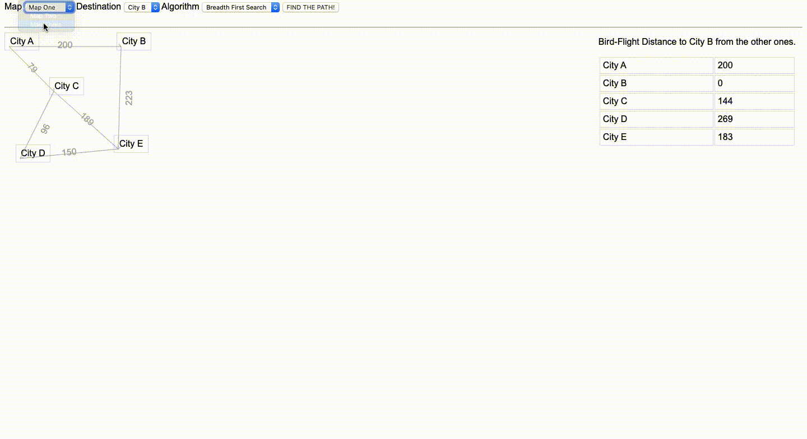

# Path Finding Algorithms

This is my Artificial Intelligence Term Project. It contains Best First Search, Breadth First Search, Depth First Search and A* algorithms. 

You can choose an algorithm you want in order to find a path from City A to another city that selected by you.

## Usage
Just open the "index.html" file in a internet browser.